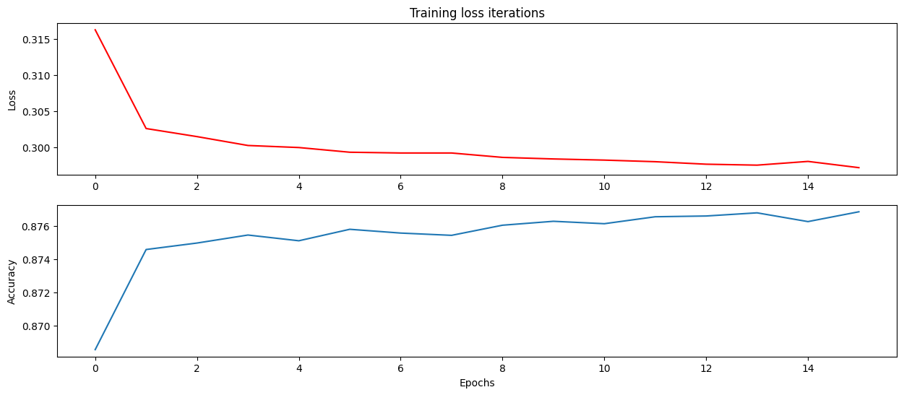

**<h1 align=center> Nearest Earth Objects Classification with Artificial Neural Networks</h1>**

<small>Picture Source: <a href="https://www.techexplorist.com/wp-content/uploads/2021/12/NASAs-Eyes-on-Asteroids.jpg">Techexplorist</a>

 	

<h2>Near-Earth Objects - NEO</h2>

Near-Earth objects (NEOs) are asteroids or comets of sizes ranging from metres to tens of kilometres that orbit the Sun and whose orbits come close to that of Earth’s. Of the more than 600 000 known asteroids in our Solar System, more than 20 000 are NEOs. An example of a NEO is 25143 Itokawa, an object about 300 m in diameter that was visited by the Japanese spacecraft Hayabusa in 2005.

 

<h2>About NEOs</h2>

NEOs could potentially hit our planet and, depending on their size, produce considerable damage. While the chance of a large object hitting Earth is very small, it would produce a great deal of destruction. NEOs thus merit active detection and tracking efforts.

The goal of SSA’s NEO Segment (SSA-NEO) is to:

<ul>
	<li>Become aware of the current and future position of NEOs relative to our planet.</li>
	<li>Estimate the likelihood of Earth impacts.</li>
	<li>Assess the consequences of any possible impact.</li>
	<li>Develop NEO deflection methods.</li>
</ul>

The NEO Segment observes NEOs, predicts their orbits, produces impact warnings when necessary and is involved in potential mitigation measures.

 

<h2>Keywords</h2>

<ul>
	<li>Classification</li>
	<li>Science and Technology</li>
	<li>Astronomy</li>
	<li>Binary Classification</li>
	<li>Near-Earth Objects</li>
	<li>Artificial Neural Networks</li>
</ul>

 

<h2>Context</h2>

There is an infinite number of objects in the outer space. Some of them are closer than we think. Even though we might think that a distance of 70,000 Km can not potentially harm us, but at an astronomical scale, this is a very small distance and can disrupt many natural phenomena. These objects/asteroids can thus prove to be harmful. Hence, it is wise to know what is surrounding us and what can harm us amongst those. Thus, this dataset compiles the list of  <b>NASA</b>  certified asteroids that are classified as the nearest earth object.

 

<h2>Statement</h2>

In this project, binary classification attrition target (class) was estimated with the model (artificial neural networks). We tried to predict Nearest Earth Objects (NEO) class (hazardous or not). All details are in <a href="https://github.com/doguilmak/Nearest-Earth-Objects-Classification/blob/main/NASA_Near_Earth_Objects-ANN_Classification.ipynb">NASA_Near_Earth_Objects-ANN_Classification.ipynb</a> file.

<small><i>Accuracy score: 0.9115566824581304</i></small>

 
	
<h2>Dataset</h2>

Dataset has 10 different columns. I made binary classification model to predict <b><i>hazardous</i></b> output from <i>est_diameter_min</i>, <i>est_diameter_max</i>, <i>relative_velocity</i>, <i>miss_distance</i> and <i>absolute_magnitude</i>.

You can take a look at relevant websites about dataset:

<ul>	
	<li>Dataset on Kaggle:<a href="https://www.kaggle.com/datasets/sameepvani/nasa-nearest-earth-objects?select=neo.csv">neo.csv</a></li>
	<li>NASA API:<a href="https://api.nasa.gov/">api.nasa.gov</a></li>
	<li>NEO Earth Close Approaches:<a href="https://cneos.jpl.nasa.gov/ca/">cneos.jpl.nasa.gov</a></li>
</ul>

 

<h2>How to Run Code</h2>

Before running the code make sure that you have these libraries:

<ul>
 <li>pandas</li>
 <li>sklearn</li>
 <li>warnings</li>
 <li>matplotlib</li>
 <li>numpy</li>
 <li>seaborn</li>
 <li>keras</li>
</ul>

<h2>Contact Me</h2>

If you have something to say to me please contact me:

<ul>
 <li>Twitter: [Doguilmak](https://twitter.com/Doguilmak)</li>
 <li>Mail address: doguilmak@gmail.com</li>
</ul>
